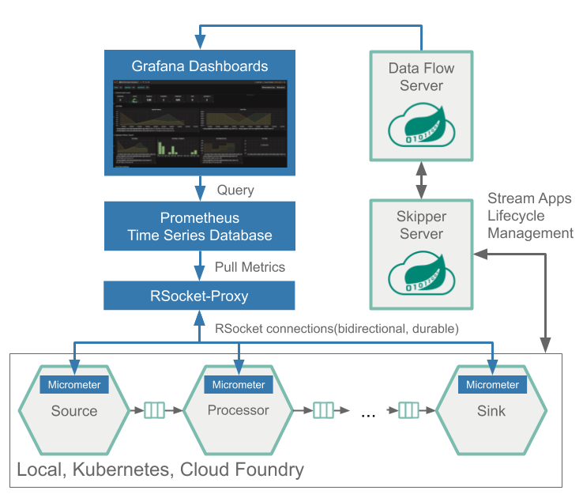

# Monitoring Architecture: Spring Cloud Data Flow + Prometheus RSocket Proxy

The Data Flow metrics architecture is designed around the [Micrometer](https://micrometer.io/) library - vendor-neutral application metrics facade.
The Spring Cloud Data Flow server leverages the [Prometheus RSocket Proxy](https://github.com/micrometer-metrics/prometheus-rsocket-proxy), 
for monitoring of `tasks`, which are short lived, as well as long lived `stream` applications. 
The RSocket based monitoring architecture is reusable across the Local, Kubernetes and Cloud Foundry platforms. 

The prebuilt `stream` and `task` applications support the Prometheus Proxy RSocket monitoring architecture. 

The [stream-apps](./stream-apps/) samples shows how to enable monitoring for custom built `source`, `processor` and `sink` apps.  

The [task-apps](./task-apps/) sample shows how to enable monitoring for custom built `task` apps.

The following image shows the general architecture of how the Stream applications are monitored:

and the same architecture is used for monitoring the tasks as well. 
 

Prometheus is configured to scrape each rsocket-proxy instance. 
Proxies in turn use the RSocket connection to pull metrics from each application. 
The scraped metrics are then viewable through Grafana dashboards. 

Following animated diagram shows the metrics collection flow:
 

