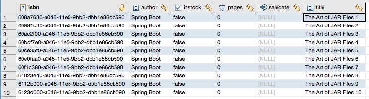

# HTTP to Cassandra Demo

In this demonstration, you will learn how to orchestrate a data pipeline using http://cloud.spring.io/spring-cloud-dataflow/[Spring Cloud Data Flow] to consume data from an `http` endpoint and write the payload to `cassandra` database. 

We will begin by discussing the steps to prep, configure and operationalize Spring Cloud Data Flow's `admin` Spring Boot application. We will deploy `admin` using  https://github.com/spring-cloud/spring-cloud-dataflow/tree/master/spring-cloud-dataflow-admin-local[Local] and as well as https://github.com/spring-cloud/spring-cloud-dataflow-admin-cloudfoundry[Cloud Foundry] SPIs (Service Provider Interface) to demonstrate how Spring Cloud Data Flow takes advantage of _dev-sandbox_ and _cloud-native_ platform capabilities respectively.

# 1: Prerequisites for Local SPI

In order to get started, make sure that you have the following components:

* Local build of https://github.com/spring-cloud/spring-cloud-dataflow[Spring Cloud Data Flow]
* Running instance of `redis`
* Running instance of `cassandra`
* Create the `book` table (in `cassandra`) using `create-table.sql`

## 1.1: Running the Sample Locally

. Launch the locally built `admin` application
+

```
→ cd <PATH/TO/SPRING-CLOUD-DATAFLOW>
→ java -jar spring-cloud-dataflow-admin-local/target/spring-cloud-dataflow-admin-local-1.0.0.BUILD-SNAPSHOT.jar

```
+

. Connect to Spring Cloud Data Flow's `shell`
+

```
→ cd <PATH/TO/SPRING-CLOUD-DATAFLOW>
→ java -jar spring-cloud-dataflow-shell/target/spring-cloud-dataflow-shell-1.0.0.BUILD-SNAPSHOT.jar

  ____                              ____ _                __
 / ___| _ __  _ __(_)_ __   __ _   / ___| | ___  _   _  __| |
 \___ \| '_ \| '__| | '_ \ / _` | | |   | |/ _ \| | | |/ _` |
  ___) | |_) | |  | | | | | (_| | | |___| | (_) | |_| | (_| |
 |____/| .__/|_|  |_|_| |_|\__, |  \____|_|\___/ \__,_|\__,_|
  ____ |_|    _          __|___/                 __________
 |  _ \  __ _| |_ __ _  |  ___| | _____      __  \ \ \ \ \ \
 | | | |/ _` | __/ _` | | |_  | |/ _ \ \ /\ / /   \ \ \ \ \ \
 | |_| | (_| | || (_| | |  _| | | (_) \ V  V /    / / / / / /
 |____/ \__,_|\__\__,_| |_|   |_|\___/ \_/\_/    /_/_/_/_/_/

1.0.0.BUILD-SNAPSHOT

Welcome to the Spring Cloud Data Flow shell. For assistance hit TAB or type "help".
dataflow:>version
1.0.0.BUILD-SNAPSHOT
```

+
. Create the stream
+

```
dataflow:>stream create cassandrastream --definition "http --spring.cloud.stream.bindings.output.contentType='application/json' | cassandra --ingestQuery='insert into book (isbn, title, author) values (uuid(), ?, ?)' --spring.cassandra.username='<USERNAME>' --spring.cassandra.password='<PASSWORD>' --spring.cassandra.port=<PORT> --spring.cassandra.contactPoints=<HOST> --spring.cassandra.keyspace='<KEYSPACE>' --includes='org.springframework.cloud.stream.demo:book:1.0.0.BUILD-SNAPSHOT' --spring.cassandra.entity-base-packages=demo.domain --queryType=INSERT" --deploy

Created and deployed new stream 'cassandrastream'
```
+
. Verify the stream is successfully deployed
+
```
dataflow:>stream list
```
+
. Notice that `cassandrastream-http` and `cassandrastream-cassandra` https://github.com/spring-cloud/spring-cloud-stream-modules/[Spring Cloud Stream] modules are running as Spring Boot applications within the `admin` as a collocated process.
+

```
2015-12-15 15:52:31.576  INFO 18337 --- [nio-9393-exec-1] o.s.c.d.a.s.l.OutOfProcessModuleDeployer : deploying module org.springframework.cloud.stream.module:cassandra-sink:jar:exec:1.0.0.BUILD-SNAPSHOT instance 0
   Logs will be in /var/folders/c3/ctx7_rns6x30tq7rb76wzqwr0000gp/T/spring-cloud-data-flow-284240942697761420/cassandrastream.cassandra
2015-12-15 15:52:31.583  INFO 18337 --- [nio-9393-exec-1] o.s.c.d.a.s.l.OutOfProcessModuleDeployer : deploying module org.springframework.cloud.stream.module:http-source:jar:exec:1.0.0.BUILD-SNAPSHOT instance 0
   Logs will be in /var/folders/c3/ctx7_rns6x30tq7rb76wzqwr0000gp/T/spring-cloud-data-flow-284240942697761420/cassandrastream.http
```
+
. Lookup the `port` for `cassandrastream-http` application from the logs [i.e: `/var/folders/c3/ctx7_rns6x30tq7rb76wzqwr0000gp/T/spring-cloud-data-flow-284240942697761420/cassandrastream.http`]. 
+

```
2015-12-15 15:52:42.896  INFO 18341 --- [           main] s.b.c.e.t.TomcatEmbeddedServletContainer : Tomcat started on port(s): 14491 (http)
2015-12-15 15:52:42.900  INFO 18341 --- [           main] o.s.c.s.m.http.HttpSourceApplication     : Started HttpSourceApplication in 6.494 seconds (JVM running for 11.291)
```
+

. Post sample data pointing to the `http` endpoint: `http://localhost:14491/messages` [i.e: **14491** in this case]
+
```
dataflow:>http post --contentType 'application/json' --data "{\"title\": \"The Art of JAR Files\", \"author\": \"Spring Boot\"}" --target http://localhost:14491/messages
> POST (application/json;charset=UTF-8) http://localhost:14491/messages {"title": "The Art of JAR Files", "author": "Spring Boot"}
> 202 ACCEPTED
```
+
. Use a database utility tool such as http://dbeaver.jkiss.org/[DBeaver] to connect to the Cassandra instance. Query the table `book` to list the persisted records
+
```
select * from book;
```

+
. That's it; you're done!

# 2: Prerequisites for Pivotal Cloud Foundry SPI

In order to get started, make sure that you have the following components:

* Cloud Foundry instance
* Local build of https://github.com/spring-cloud/spring-cloud-dataflow[Spring Cloud Data Flow]
* Local build of Spring Cloud Data Flow's https://github.com/spring-cloud/spring-cloud-dataflow-admin-cloudfoundry[Cloud-Foundry-Admin]
* Running instance of `redis` in Cloud Foundry
* Running instance of `cassandra`
* Create the `book` table (in `cassandra`) using `create-table.sql`


## 2.1: Running the Sample in Cloud Foundry

. Verify that CF instance is reachable
+

```
→ cf api
API endpoint: https://api.system.navy.springapps.io (API version: 2.43.0)

→ cf apps
Getting apps in org sabby-dataflow / space development as sabby...
OK

No apps found
```
+
. Follow the instructions to deploy Spring Cloud Data Flow's `admin` from https://github.com/spring-cloud/spring-cloud-dataflow-admin-cloudfoundry/blob/master/README.adoc[CF SPI] repo

+
. Once you complete step#3 from https://github.com/spring-cloud/spring-cloud-dataflow-admin-cloudfoundry/blob/master/README.adoc[CF SPI] instructions, you'll be able to list the newly deployed `s-c-dataflow-admin` application in Cloud Foundry
+

```
→ cf apps
Getting apps in org sabby-dataflow / space development as sabby...
OK

name                 requested state   instances   memory   disk   urls
s-c-dataflow-admin   started           1/1         1G       1G     s-c-dataflow-admin.app.navy.springapps.io
```

+
. Notice that `s-c-dataflow-admin` application is started and ready for interaction via `http://s-c-dataflow-admin.app.navy.springapps.io` endpoint

. Connect to Spring Cloud Data Flow's `shell`. 
+

```
→ cd <PATH/TO/SPRING-CLOUD-DATAFLOW>
→ java -jar spring-cloud-dataflow-shell/target/spring-cloud-dataflow-shell-1.0.0.BUILD-SNAPSHOT.jar

  ____                              ____ _                __
 / ___| _ __  _ __(_)_ __   __ _   / ___| | ___  _   _  __| |
 \___ \| '_ \| '__| | '_ \ / _` | | |   | |/ _ \| | | |/ _` |
  ___) | |_) | |  | | | | | (_| | | |___| | (_) | |_| | (_| |
 |____/| .__/|_|  |_|_| |_|\__, |  \____|_|\___/ \__,_|\__,_|
  ____ |_|    _          __|___/                 __________
 |  _ \  __ _| |_ __ _  |  ___| | _____      __  \ \ \ \ \ \
 | | | |/ _` | __/ _` | | |_  | |/ _ \ \ /\ / /   \ \ \ \ \ \
 | |_| | (_| | || (_| | |  _| | | (_) \ V  V /    / / / / / /
 |____/ \__,_|\__\__,_| |_|   |_|\___/ \_/\_/    /_/_/_/_/_/

1.0.0.BUILD-SNAPSHOT

Welcome to the Spring Cloud Data Flow shell. For assistance hit TAB or type "help".
server-unknown:>
```
+
. Connect the `shell` with `admin` running at `http://s-c-dataflow-admin.app.navy.springapps.io`
+

```
server-unknown:>admin config server http://s-c-dataflow-admin.app.navy.springapps.io
Successfully targeted http://s-c-dataflow-admin.app.navy.springapps.io
dataflow:>version
1.0.0.BUILD-SNAPSHOT
```
+
. Create the stream
+

```
dataflow:>stream create cassandrastream --definition "http --spring.cloud.stream.bindings.output.contentType='application/json' | cassandra --ingestQuery='insert into book (isbn, title, author) values (uuid(), ?, ?)' --spring.cassandra.username='<USERNAME>' --spring.cassandra.password='<PASSWORD>' --spring.cassandra.port=<PORT> --spring.cassandra.contactPoints=<HOST> --spring.cassandra.keyspace='<KEYSPACE>' --includes='org.springframework.cloud.stream.demo:book:1.0.0.BUILD-SNAPSHOT' --spring.cassandra.entity-base-packages=demo.domain --queryType=INSERT" --deploy

Created and deployed new stream 'cassandrastream'
```
+
. Verify the stream is successfully deployed
+
```
dataflow:>stream list
```
+
. Notice that `cassandrastream-http` and `cassandrastream-cassandra` https://github.com/spring-cloud/spring-cloud-stream-modules/[Spring Cloud Stream] modules are running as _cloud-native_ (microservice) applications in Cloud Foundry
+

```
→ cf apps
Getting apps in org sabby-dataflow / space development as sabby...
OK

name                        requested state   instances   memory   disk   urls
cassandrastream-cassandra   started           1/1         1G       1G     cassandrastream-cassandra.app.navy.springapps.io
cassandrastream-http        started           1/1         1G       1G     cassandrastream-http.app.navy.springapps.io
s-c-dataflow-admin          started           1/1         1G       1G     s-c-dataflow-admin.app.navy.springapps.io
```
+
. Lookup the `url` for `cassandrastream-http` application from the list above. Post sample data pointing to the `http` endpoint: `<YOUR-cassandrastream-http-APP-URL>/messages`
+
```
dataflow:>script --file <PATH/TO>/spring-cloud-dataflow-samples/http-to-cassandra/data.txt

http post --contentType 'application/json' --data "{\"title\": \"The Art of JAR Files 1\", \"author\": \"Spring Boot\"}" --target http://cassandrastream-http.app.navy.springapps.io/messages
> POST (application/json;charset=UTF-8) http://cassandrastream-http.app.navy.springapps.io/messages {"title": "The Art of JAR Files 1", "author": "Spring Boot"}
> 202 ACCEPTED
...
...
...
```
+
. Use a database utility tool such as http://dbeaver.jkiss.org/[DBeaver] to connect to the Cassandra instance. Query the table `book` to list all the 10 rows 
+
```
select * from book;
```


+
. Now, let's try to take advantage of Pivotal Cloud Foundry's platform capability. Let's scale the `cassandrastream-http` application from 1 to 3 instances
+
```
→ cf scale cassandrastream-http -i 3
Scaling app cassandrastream-http in org sabby-dataflow / space development as sabby...
OK
```
+
. Verify App instances (3/3) running successfully
+
```
→ cf apps
Getting apps in org sabby-dataflow / space development as sabby...
OK

name                        requested state   instances   memory   disk   urls
cassandrastream-cassandra   started           1/1         1G       1G     cassandrastream-cassandra.app.navy.springapps.io
cassandrastream-http        started           3/3         1G       1G     cassandrastream-http.app.navy.springapps.io
s-c-dataflow-admin          started           1/1         1G       1G     s-c-dataflow-admin.app.navy.springapps.io
```
+
. That's it; you're done!

# 3: Summary 

In this sample, you have learned:

* How to use Spring Cloud Data Flow in `Local` and `Pivotal Cloud Foundry`
* How to use Spring Cloud Data Flow's `shell`
* How to create streaming data pipeline to connect and write to `Cassandra`
* How to scale data microservice applications on `Pivotal Cloud Foundry`